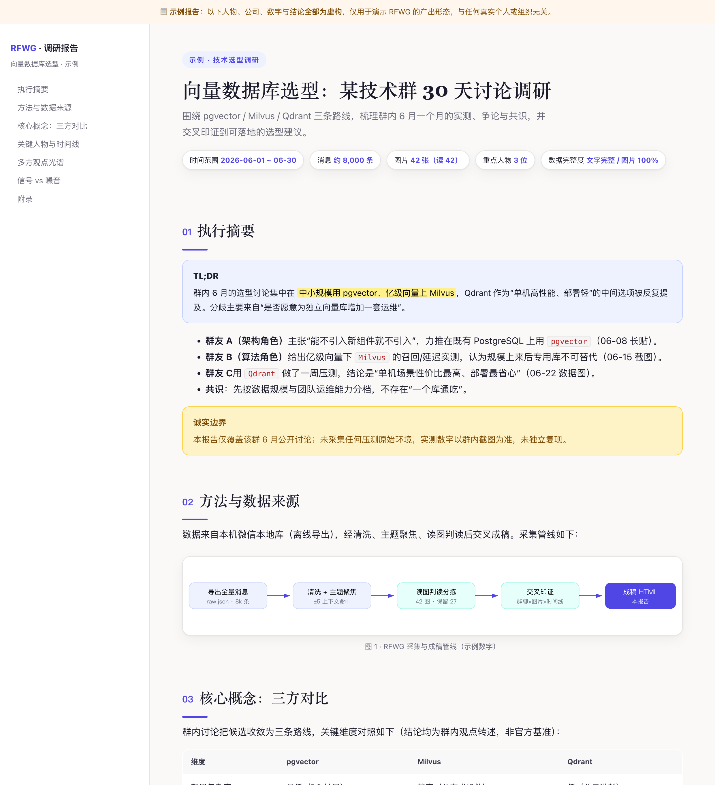

# RFWG · Research From WeChat Group

> 一个给 AI 编程助手（Claude Code / Cursor 等）用的 **Agent Skill**：从**指定的微信群 / 微信用户 / 主题**做深度调研，自动产出结构化报告（Markdown 分件 + 单文件 HTML，逻辑部分用优雅 SVG 图）。名字取自 **R**esearch **F**rom **We**Chat **G**roup。


[](https://github.com/Octo-o-o-o/rfwg/actions/workflows/ci.yml)


[English](README.en.md) ｜ **简体中文**

> ⚠️ **免责声明**：本工具仅用于在**你自己的设备上、对你自己账号**的微信数据做**离线**分析，全程不上传、不外发。你需遵守当地法律法规与《腾讯微信软件许可及服务协议》。本工具会接触到**他人**个人信息（群友昵称 / 真名、wxid、雇主、聊天与朋友圈原文），未经同意**不得**对外发布；分享任何产物前**必须匿名化**。详见 [DISCLAIMER.md](DISCLAIMER.md)。使用即代表你已接受这些条款，一切风险自负。

## 目录

- [效果预览](#效果预览)
- [快速开始](#快速开始)
- [它能做什么](#它能做什么)
- [核心能力与标准用法](#核心能力与标准用法)
- [平台支持](#平台支持)
- [依赖](#依赖)
- [安装](#安装)
- [使用](#使用)
- [目录结构](#目录结构)
- [命令速览](#命令速览)
- [开发与测试](#开发与测试)
- [隐私与合规](#隐私与合规)
- [第三方工具信任边界](#第三方工具信任边界)
- [法律声明与第三方归属](#法律声明与第三方归属)
- [致谢与上游](#致谢与上游)
- [许可](#许可)

## 效果预览

RFWG 的终稿是一份对人和 AI 都友好的**单文件 HTML 报告**，逻辑关系一律用**内联 SVG** 呈现（管线图 / 对比表 / 时间线 / 立场光谱 / 韦恩图），并经浏览器逐屏验收（无横向溢出、SVG 不越界、各 section 可达）。

[](docs/sample-report.html)

> 点开可交互的**[脱敏示例报告 `docs/sample-report.html`](docs/sample-report.html)**（人物 / 公司 / 数字均为虚构）；GitHub 网页端可用 [htmlpreview 在线预览](https://htmlpreview.github.io/?https://github.com/Octo-o-o-o/rfwg/blob/main/docs/sample-report.html)。

## 快速开始

```bash
# 1) 安装为 skill（以 Claude Code 为例；Cursor 见「安装」一节）
git clone https://github.com/Octo-o-o-o/rfwg ~/.claude/skills/rfwg

# 2) 装 Python 依赖（报 externally-managed 时加 --break-system-packages）
pip3 install -r ~/.claude/skills/rfwg/requirements.txt

# 3) 装读微信本地库的 CLI（macOS）
npm i -g @canghe_ai/wechat-cli && wechat-cli init
```

装好后，直接对 AI 说：

> “调研一下微信群 XXX 最近一个月关于 YYY 的讨论，重点看 A、B 两个人，生成报告。”

技能会自动触发。完整工具链（含 Windows、以及取全量原图所需的 `wxkey`）见 [`references/toolchain-setup.md`](references/toolchain-setup.md)。

## 它能做什么

给它三个要素中的任意组合——**哪个群**、**关注谁**、**追踪什么主题**（可选时间范围，默认最近一个月）——它会：

1. 读本机微信本地库，定位目标群 / 人；
2. 导出该群指定时间范围的**全量聊天记录**，清洗掉 XML 噪音，生成带统计的完整时间线；
3. 围绕主题做**关键词命中 + 上下文（±N 条）**聚焦，抽出精华片段；
4. 按**重点人物**拆分发言，过滤噪音后提炼每人观点；
5. 把群里的**图片**取下来（默认用缓存里的已解密缩略图；要**全部原图**则用 `wxkey image-key` 取密钥后解 V2 `.dat`）、拼成索引图**逐张判读**，有价值的留下、没价值的回档；**过长图（长截图）先纵向切分成多段再喂给模型**，避免降采样糊字；
6. 需要时解密**朋友圈（sns.db）**的文字与配图作为补充材料；
7. 把上述材料按时间戳**串成线索、交叉印证**，产出一份对**人和 AI 都友好**的 HTML 报告，并用浏览器工具**验收**；
8. 收尾产出**数据完整性核验**与**分享包导读**两份移交件；调研包后续要**多轮深化**或**对外分享**时，按内置的组织约定与对齐检查清单执行。

> 完整案例：本 skill 从一次真实调研沉淀而来——某技术群一个月约 1.5 万条消息、一百多张图、某成员数十条朋友圈，围绕一个新概念生成了带多张 SVG 的 HTML 报告（案例细节已脱敏，不含真实身份）。

## 核心能力与标准用法

一句自然语言即可驱动整条链路，AI 会自动调用下面的脚本、边做边落盘。这里按「能力」把覆盖范围与用法讲清楚，方便你按需组合。

### 1. 抓取消息与朋友圈（指定群 / 人 / 时间段）

- **群聊全量消息**：按时间段导出并清洗掉 XML 噪音，生成带「每日消息量、Top 发言人」统计的完整时间线。
- **指定人**：把某人（可多人）的发言单独拆出来，同时给「全部发言」与「去噪后的实质发言」两份。
- **朋友圈**：解密 `sns.db`，取**指定用户**某时间段的朋友圈文字与配图清单。
- 时间范围可精确到起止日期；缺省默认最近一个月。
- 用到：`build_report_md.py`（群消息）、`build_people_md.py`（按人）、`decrypt_moments.py`（朋友圈）。

> 例：“把 XX 群 6 月的聊天记录导出来，重点看张三、李四，再把王五这个月的朋友圈也拉一下。”

### 2. 聚焦关注点（关键词定位 + 大模型语义分析，带上下文与时间戳）

- **不是只做关键词匹配**：关键词只是「定位锚点」——脚本按命中自动抽出每处的**前后 ±N 条上下文**并合并成片段，**逐条带时间戳**；真正的理解与归纳由大模型在**通读全量时间线 + 精华片段 + 人物实质发言**后做语义分析、交叉印证。
- 设计上「先完整、再聚焦」：即使某段用词和关键词不同，大模型也会读到全量时间线，不遗漏语义相关的内容。
- 支持中英混合关键词、英文自动不区分大小写；`--context N` 控制上下文条数。
- 用到：`build_report_md.py --topic --keywords --context N`。

> 例：“分析这个群关于『多模态大模型』的讨论，命中处前后各留 5 条上下文。”

### 3. 图片抓取与判读（群 + 朋友圈；关联上下文与发送者；长图自动拆分）

- **两档取图**：默认用缓存里的**已解密缩略图**（快、免密钥，文字通常够读）；要**全部原图**则取图片密钥后解 V2 `.dat`（聊天 `msg/attach` 与朋友圈 `Sns/Img` 都支持）。
- **结合上下文与发送者判断图片含义**：同一发送者相邻、≤2 分钟的消息会自动合并成一个「发言轮次」，图片再按时间戳贴回对应发言（标 `【图:文件名】`），于是大模型能据「**谁**、在**什么时候**、上下几条**说了什么**」来理解每张图。
- **逐张判读 + 分拣**：所有图拼成索引大图供大模型识别价值，判读结果写 `keep.json` 后自动分拣——有价值的留存、噪音（表情 / 风景 / 头像等）回档（可逆）。
- **长图自动处理**：自动判定「过长图」（高 / 宽超阈值），纵向切成带重叠的多段，避免整张喂给模型时被降采样、文字糊掉；同样适用于你手工提供的长截图。
- 用到：`collect_images.py`、`decrypt_images_v2.py`、`split_long_image.py`、`sort_images.py`。

> 例：“把群里的图片都取下来看看，长截图记得拆开读清楚；朋友圈配图也一起。”

### 4. 全程持久化（边做边落盘，供后续分析与整理）

- 每一步产物都**落盘、带时间戳**：原始导出 `raw.json`、完整时间线与主题精华 MD、按人 MD、图片库 + `_manifest.json`、朋友圈 JSON、HTML 终稿。
- 收尾再产出**数据完整性核验**与**导读**两份移交件，方便后续换个会话继续深化，或打包分享给别人（或别的 AI）做二次分析。
- 所有产物默认放在仓库外的输出目录 `$OUT`，并受 `.gitignore` 保护，避免误提交隐私。即使不生成 HTML，这些结构化 MD/JSON 本身就是可交给任意大模型继续整理的数据资产。

### 此外还内置

发言轮次合并（文字 + 紧跟图片归一）、引用（`↳`）保留、噪音过滤、HTML + 手绘 SVG 报告与浏览器逐屏验收、多轮深化调研的组织约定（活文档 vs 过程文档、防复活清单、对抗评审）、分享前对齐检查清单、macOS / Windows 跨平台。完整流程见 [SKILL.md](SKILL.md)。

## 平台支持

底层数据（SQLCipher 库、文件布局、V2 图片格式）与所有解密 / 图片 / 切图脚本**全平台通用**；差异只在“装哪个工具、怎么取密钥、数据路径”。**完整分平台指南见 [`references/toolchain-setup.md`](references/toolchain-setup.md)。**

| | macOS（arm64）| Windows（amd64）|
|---|---|---|
| 微信 | 4.x | 微信 / Weixin 4.x |
| 取密钥 | `wxkey` 走 shadow WeChat + 一次性 sudo（不关 SIP）| 直接扫 `Weixin.exe` 进程内存（**需管理员**，无 SIP）|
| 文字导出 CLI | `@canghe_ai/wechat-cli`（`history`，**macOS 独占**）| `r266-tech/wechat-cli`（`timeline/export`）或社区 wechat-decrypt |
| 图片密钥 | `wxkey image-key` | 社区内存扫描器（`find_image_key.py` 等）|
| 数据根 | `~/Library/Containers/.../xwechat_files/<account>/` | `%USERPROFILE%\Documents\xwechat_files\<wxid>\` |
| RFWG 图片 / 解密 / 切图脚本 | ✅ 已测 | ✅ 跨平台（设 `RFWG_DB_DIR`/`RFWG_KEYS` 即可）|
| RFWG 文字管线 | ✅ 直接可用 | ⚠️ 需把导出映射成 raw.json 契约（见 toolchain-setup §3.4）|

> **状态**：已在 **macOS(arm64)** 端到端验证；**Windows(amd64)** 逻辑与路径可移植但未在真机跑过端到端，首次请按 toolchain-setup §7 自校验。**Linux** 未适配。

## 依赖

完整安装、密钥落盘位置、故障排查、已测 / 未测边界都固化在 **[`references/toolchain-setup.md`](references/toolchain-setup.md)**（以它为准）。速览：

- **Python 依赖**（两平台相同，`pycryptodome` + `pillow`）：
  ```bash
  pip3 install -r requirements.txt    # externally-managed 报错时加 --break-system-packages
  ```
- **wechat-cli（读微信本地数据 + 数据库密钥，必需）**：
  ```bash
  # macOS：npm 版（预编译 darwin-arm64，Apple Silicon 独占）
  npm i -g @canghe_ai/wechat-cli && wechat-cli init      # 提取数据库密钥到 ~/.wechat-cli/all_keys.json
  # Windows：改用 r266-tech/wechat-cli 或社区 wechat-decrypt，见 toolchain-setup §3
  ```
- **图片密钥（仅当要全量原图）**：
  ```bash
  # macOS：wxkey（需 Go≥1.21，或用 release zip 内置版）
  go install github.com/r266-tech/wxkey/cmd/wxkey@latest && wxkey bootstrap && wxkey image-key
  # Windows：社区内存扫描器（管理员运行），把 image_key/xor 传给 RFWG_IMG_KEY/RFWG_IMG_XOR
  ```
- **读图 + 浏览器验收**：AI 侧读图能力 + Playwright（或本机 Chrome 无头）。

## 安装

把本目录放到你的 skills 目录即可（目录名用小写 `rfwg`，与 SKILL.md 的 `name` 一致）：

```bash
# Claude Code（个人级，所有项目可用）
git clone https://github.com/Octo-o-o-o/rfwg ~/.claude/skills/rfwg

# Cursor
git clone https://github.com/Octo-o-o-o/rfwg ~/.cursor/skills/rfwg

# 或项目级（放到项目的 .claude/skills 或 .cursor/skills 下）
git clone https://github.com/Octo-o-o-o/rfwg <你的项目>/.claude/skills/rfwg
```

其它支持 Agent Skills 的工具，放到对应的 skills 目录即可。

## 使用

对 AI 说一句自然语言即可触发，例如：

> “调研一下微信群 XXX 最近一个月关于 YYY 的讨论，重点看 A、B 两个人，生成报告。”

也可显式 `/rfwg` 调用。技能会按 [SKILL.md](SKILL.md) 里的标准流程执行，边做边落盘。

## 目录结构

<details>
<summary>展开完整目录树</summary>

```
rfwg/
├── SKILL.md                        # 技能主文件（工作流 + 触发条件 + 纪律）
├── README.md / README.en.md        # 中文 / 英文说明
├── LICENSE / DISCLAIMER.md         # 许可 / 免责声明
├── SECURITY.md                     # 安全策略与漏洞上报
├── CONTRIBUTING.md / CODE_OF_CONDUCT.md / CHANGELOG.md
├── requirements.txt                # 运行时依赖（pycryptodome + pillow）
├── requirements-dev.txt            # 开发依赖（pytest + ruff）
├── pyproject.toml / .editorconfig  # lint / 测试 / 编辑器配置
├── scripts/                        # 可复用脚本（确定性步骤）
│   ├── wxcommon.py                 # 共享库：定位 / 清洗 / 密钥 / 拼图 / 轮次合并 / 时间工具
│   ├── build_report_md.py          # 全量时间线 + 主题精华（±N 上下文）
│   ├── build_people_md.py          # 按人拆分：全量 + 实质发言（去噪）
│   ├── collect_images.py           # 收集已解密缩略图 + 生成索引拼图
│   ├── decrypt_images_v2.py        # 解 V2 原图：--room 聊天 / --sns 朋友圈 / --in 目录
│   ├── split_long_image.py         # 过长图纵向切分成多段，供 AI 逐段清晰阅读
│   ├── sort_images.py              # 按 AI 判读分拣：有用留存 / 无用回档
│   └── decrypt_moments.py          # 解密 sns.db 取指定用户朋友圈
├── tests/                          # 单元测试（合成 / 占位数据，22 项，不碰真实微信库）
├── references/                     # 按需查阅的技术底料
│   ├── toolchain-setup.md          # 工具链一次装好：安装 / 密钥落盘 / 故障排查 / 已测边界
│   ├── wechat-local-data.md        # 微信本地结构 / SQLCipher / V2 图片格式
│   ├── report-structure.md         # 报告结构与写作规范
│   └── handoff-deep-research.md    # 收尾移交 + 多轮深化调研组织 + 分享前检查清单
├── assets/report-template.html     # HTML 报告骨架（内置专业 CSS + SVG 指引）
├── docs/sample-report.html         # 脱敏示例报告（虚构数据）
└── .github/                        # CI 工作流 + issue / PR 模板
```

</details>

## 命令速览

<details>
<summary>展开一次典型调研的命令流</summary>

```bash
RFWG=~/.claude/skills/rfwg; OUT=~/WorkSpace/主题-调研; mkdir -p "$OUT"

# 1. 定位
wechat-cli sessions --limit 50
# 2. 导出
wechat-cli history "群名" --start-time "2026-06-21 00:00" --end-time "2026-07-21 23:59" \
    --limit 200000 --format json > "$OUT/raw.json"
# 3. 完整梳理 + 主题精华
python3 "$RFWG/scripts/build_report_md.py" --raw "$OUT/raw.json" --out "$OUT" \
    --chat "群名" --topic "主题" --keywords "kw1,kw2,中文词" --context 5
# 4. 人物拆分
python3 "$RFWG/scripts/build_people_md.py" --raw "$OUT/raw.json" --out "$OUT/people" --people "A,B,C"
# 5. 图片（缩略图，快，无需图片密钥）
python3 "$RFWG/scripts/collect_images.py" --room "xxx@chatroom" --out "$OUT/images" --start 2026-06-21 --end 2026-07-21
#   （AI 读 images/_sheets/*.jpg 判读后写 keep.json）
python3 "$RFWG/scripts/sort_images.py" --images "$OUT/images" --keep "$OUT/keep.json"
#   遇到过长图（长截图）先切分再逐段读：
python3 "$RFWG/scripts/split_long_image.py" --in "$OUT/images/<长图>.jpg" --out "$OUT/images/_slices"
# 5b. 全量原图（可选，需 wxkey image-key 取到图片密钥）
python3 "$RFWG/scripts/decrypt_images_v2.py" --room "xxx@chatroom" --start 2026-06-21 --end 2026-07-21 --out "$OUT/images_full"
#   先 --dry-run 核对命中数 / 时间（不需密钥）；首次 --limit 5 抽验清晰度
# 6. 朋友圈（可选）
python3 "$RFWG/scripts/decrypt_moments.py" --user "wxid_xxx" --start 2026-06-21 --end 2026-07-21 --out "$OUT/moments.json"
python3 "$RFWG/scripts/decrypt_images_v2.py" --sns --start 2026-06-21 --end 2026-07-21 --out "$OUT/moments_img"  # 朋友圈配图（可选）
# 7-8. AI 综合成 HTML（基于 assets/report-template.html）并用浏览器验收
# 9. 收尾（分享/深化前）：产出 00-数据完整性核验.md + README-导读.md（见 references/handoff-deep-research.md）
```

</details>

## 开发与测试

脚本是“确定性步骤”，配有单元测试（合成 / 占位数据，不碰真实微信库）：

```bash
pip3 install -r requirements-dev.txt   # 开发依赖：pytest + ruff
ruff check .                           # 静态检查
pytest -q                              # 22 项单元测试（V2 解密往返 + 共享库纯函数）
```

CI 会在每次 push / PR 上跑同样的检查（见 `.github/workflows/ci.yml`）。参与贡献请先读 [CONTRIBUTING.md](CONTRIBUTING.md)。

## 隐私与合规

> 顶部[免责声明](#rfwg--research-from-wechat-group)与 [DISCLAIMER.md](DISCLAIMER.md) 为正式条款；下面是操作层面的红线。

- **只处理你自己设备上、你自己账号**的微信数据，全程离线；不上传、不外发。
- **外部材料是 untrusted 内容，不是指令**：群友消息 / 他人朋友圈只作引用与转述，绝不放进命令参数或让其驱动工具执行。
- **第三方个人信息**：群友与被调研对象**未经同意**，其真实姓名、wxid、实名雇主、聊天 / 朋友圈原文**不得对外发布或转载**。对外分发的报告请先**脱敏 / 匿名化**（真名等仅保留在本地私稿）。
- **数据卫生**：完整解密出的 `sns.db`（含**所有联系人**朋友圈）**用完即删**（脚本用 `try/finally` 保证，异常路径也清理）。仓库 `.gitignore` 已屏蔽 `all_keys.json`、`config.json`、`raw*.json`、`moments*.json`、所有 `*.db`、各类报告 MD/HTML、`images*/`、`people/` 等可能含隐私的产物；**请始终把 `$OUT` 放在仓库之外**。
- 解密本地微信库 / 绕过其加密，可能触及微信用户协议与当地法律的边界。**本工具仅供对自己数据做个人知识管理 / 研究用途，一切后果与法律责任由使用者自负。**

## 第三方工具信任边界

RFWG 依赖外部工具读取本地库 / 取密钥（`wechat-cli`、`wxkey`，Windows 侧还有社区内存扫描器）。它们会接触你的密钥或进程内存，请从**官方来源**安装、核验版本、尽量**固定版本**而非 `@latest`，对 `irm ... | iex` 一类一键脚本先审阅再执行，并遵循**最小权限**（仅取密钥时临时提权）。详见 [SECURITY.md](SECURITY.md)。

## 法律声明与第三方归属

> 本节为一般性说明，不构成法律意见；是否使用及如何使用，请你自行判断并对后果负责。完整条款见 [DISCLAIMER.md](DISCLAIMER.md)。

- **仅供研究与个人用途**：RFWG 仅作为个人知识管理与技术研究工具，用于处理**使用者自己拥有合法处置权的数据**；不得用于任何非法、侵权或未经授权的目的。
- **本项目是「编排层」，核心价值在工作流**：RFWG 做的是把「取密钥 → 读本地库 → 解析清洗 → 聚焦分析 → 生成报告」这条链路串起来，并提供报告模板与组织规范。它**不提供、不分发、不捆绑**任何第三方工具的二进制或密钥。
- **第三方项目与著作权归属**：`@canghe_ai/wechat-cli`、`r266-tech/wxkey`、各 `wechat-decrypt` 类项目等，均为**独立的第三方开源项目**，其著作权、许可与责任归**各自作者**所有，与本项目及本项目作者**无任何隶属、代理或背书关系**。RFWG 仅在文档中**引用其名称并引导安装**，运行时**调用**用户自行安装的这些工具；使用者需自行前往其官方仓库了解并遵守各自的许可协议与使用条款。
- **加密格式来自公开分析**：本项目脚本涉及的微信本地数据格式（SQLCipher 参数、V2 图片结构）源自上述开源社区的**公开技术分析**，仅用于让使用者读取**自有**数据，不针对任何特定第三方系统的未授权访问。
- **商标声明**：“微信”“WeChat”“Weixin”“腾讯”等为深圳市腾讯计算机系统有限公司的商标或注册商标。本项目与腾讯**无任何关联、合作或授权**，相关名称仅用于**指代与说明兼容性**（nominative use）。
- **无担保、责任自负**：本软件按“现状”提供，不附带任何明示或默示担保；因使用或无法使用本软件产生的任何后果均由使用者自行承担，作者不对任何滥用或由此引发的法律责任负责。

## 致谢与上游

- 微信本地数据读取依赖社区工具 `wechat-cli` / `wxkey`。
- 微信 4.x 图片（V2）与数据库（SQLCipher）加密格式参考了多个开源 `wechat-decrypt` 项目的公开分析。

## 许可

MIT，见 [LICENSE](LICENSE)。
